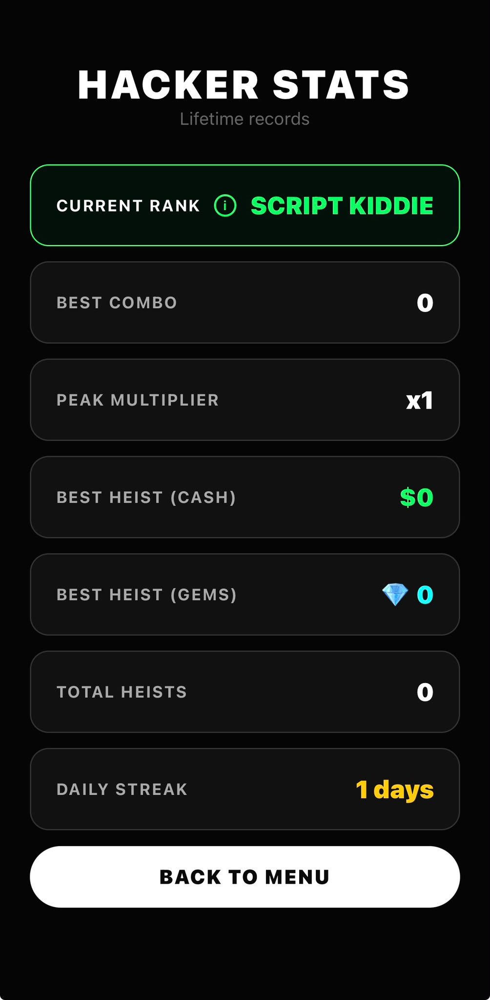
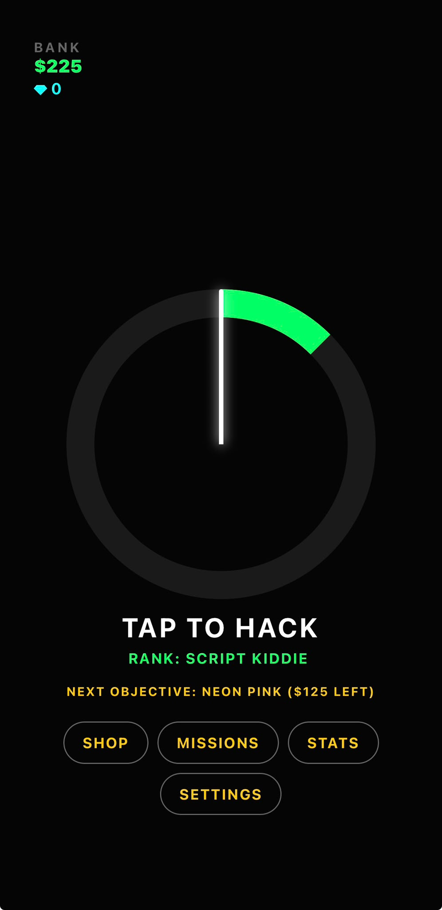
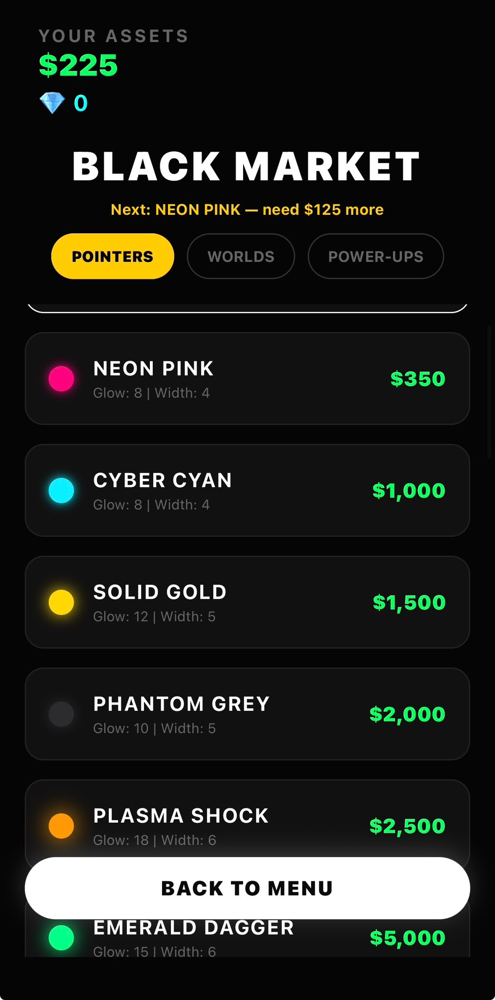
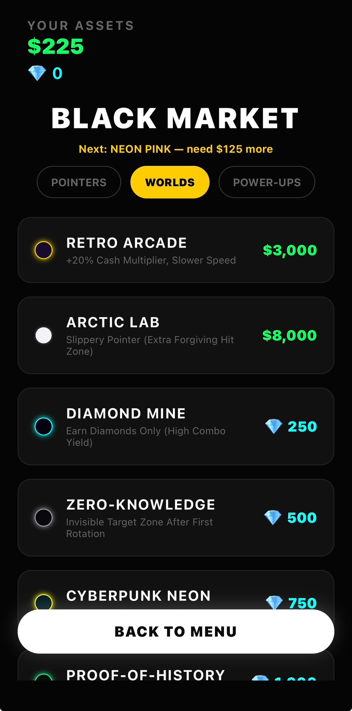
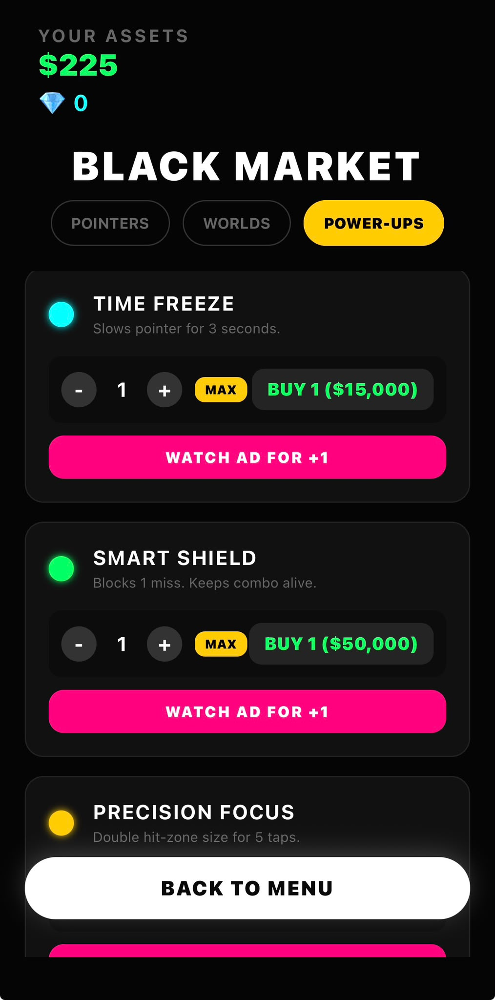
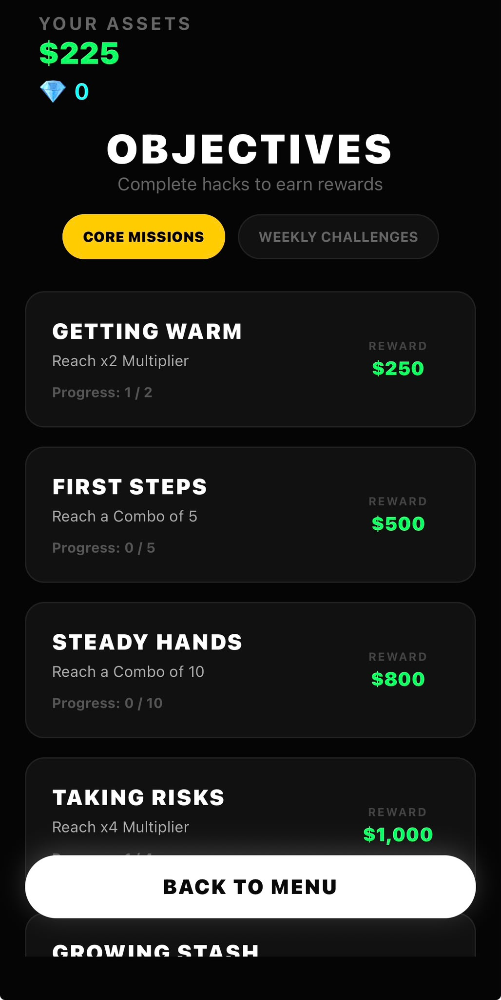

# Tap Heist

[](https://apps.apple.com/il/app/tap-heist/id6771778269)

## Tap Heist Gameplay





Tap Heist is a fast-paced idle tapping game built with React Native and Expo. Tap precisely through rotating vault rings, build combos, earn cash and diamonds, and spend your winnings on skins, worlds, and tactical power-ups.

## Overview

Tap Heist combines a simple tap mechanic with layered progression, cosmetics, and world-specific modifiers. Players build combos, grow their bank, unlock new worlds and pointer skins, and push for bigger multipliers while managing risk.

## Current Release

- Version 1.4.1 is live on the App Store.
- The game includes a full progression loop with missions, weekly challenges, prestige offers, and a large cosmetics catalog.
- The experience is designed around short, replayable runs with reward tiers, risk decisions, and special worlds.

## Core Gameplay

- Tap the vault ring when the pointer overlaps the active target zone.
- Successful taps increase your combo and multiplier.
- Cash runs reward cash by default, while certain targets and worlds can award diamonds.
- Missing the target ends the run, though part of the run value is banked as cash.
- Risk mode can appear during a run, giving you the option to cash out or push for a larger reward.
- Rewarded ads can revive a run after a miss.

## Progression Systems

- Daily rewards grant cash and include streak bonuses, with diamond rewards on every third streak claim.
- Core missions track combo, multiplier, and bank milestones.
- Weekly missions rotate a set of active objectives each week.
- Hacker ranks unlock as you progress through total heists and best combo performance.
- Prestige offers appear when your bank reaches certain thresholds and provide permanent multiplier growth.

## Customization

- The shop includes 26 pointer skins split across cash and diamond purchases.
- Skins include multiple shapes and gradient variants.
- Nine worlds are available, each with a distinct visual style and gameplay trait.
- The current worlds are Darknet, Retro Arcade, Arctic Lab, Cyberpunk Neon, Proof-of-History, Diamond Mine, Zero-Knowledge, Blood Moon, and Deep Nebula.

## Power-Ups

The tactical arsenal includes three consumables:

- Smart Shield blocks one miss.
- Time Freeze slows the pointer for three seconds.
- Precision Focus doubles the hit zone for five taps.

Power-ups can be purchased with cash or diamonds, and some can also be earned from rewarded ads.

## Game Systems

- The base tap reward is 4 cash per hit.
- Diamond targets appear during runs and use a distinct reward tier color flow.
- Firewall mode shrinks the active zone and increases difficulty.
- Reward tiers shift as combo grows, with special scaling for certain worlds.
- The main UI shows bank balance, diamonds, current run score, combo, multiplier, and active boosts.

## Tech Stack & Technical Highlights

- **Framework:** React Native 0.81.5, Expo 54
- **Language:** TypeScript 5.9
- **Navigation:** Expo Router
- **Animations & UI:** React Native Reanimated, React Native SVG
- **Hardware Integration:** Expo Haptics
- **Monetization:** Google Mobile Ads

### Technical Challenges & Solutions

- **High-Performance UI:** Implemented smooth, 60FPS animations using **React Native Reanimated** to ensure ultra-responsive gameplay during fast-paced tap events without dropping frames.
- **Anti-Cheat Local Storage:** Designed a secure, serverless local storage architecture using **Expo Secure Store** to preserve player progression, bank balance, and cosmetics while protecting against data tampering.

## Installation

### Prerequisites

- Node.js 18+
- npm or yarn
- Expo tooling

### Run Locally

1. Clone the repository.
2. Install dependencies with npm install.
3. Start the app with npm start.
4. Run it on iOS, Android, or web through the Expo tooling.

### Production Builds

Use EAS to build and publish iOS or Android releases.

## Project Structure

```text
tapheist/
├── app/
│   ├── _layout.tsx
│   ├── index.tsx
│   ├── missions.tsx
│   ├── settings.tsx
│   ├── shop.tsx
│   └── stats.tsx
├── components/
│   ├── GameHeader.tsx
│   ├── GameUI.tsx
│   ├── GradientPointer.tsx
│   ├── TacticalArsenal.tsx
│   └── VaultRing.tsx
├── gamedata.ts
├── gameHelpers.ts
├── app.json
├── package.json
└── tsconfig.json
```

## License

This project is proprietary. All rights reserved.

Developed by FIXRA Group.
